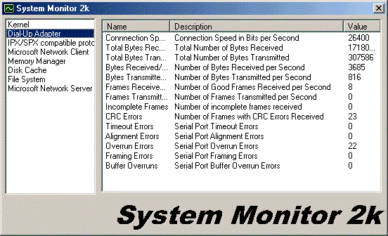



## System Monitor 2k \- View CPU Usage, kb/s in Internet connections, etc\.

### Description

Similar to the System Monitor application found in Windows, this ActiveX DLL (source included) lets you include a CPU Usage monitor, lets you see the amount of bytes sent/received per second over the Internet, the amount of bytes read/written per second on a drive, or anything else that you see in Windows' System Monitor!

Usage:

Dim SysMon As New SysMon

CPUUsage=SysMon("KERNEL")("CPUUsage")

NetKBReadPerSec=SysMon("Dial-Up Adapter")("BytesRecvd")

NetKBTransmitPerSec=SysMon("Dial-Up Adapter")("BytesXmit")

It's that simple!

Not too commented but it's VERY easy to use.

Also, IT MAY NOT WORK IN WINDOWS NT, because NT uses a HKEY_PERFORMANCE_DATA key instead of HKEY_DYN_DATA, and I don't have NT to see the structure of it, if anyone makes modifications for it to run in NT please post them here.

Enjoy!
 
### More Info
 

             |
---                |---
**Submitted On**   |2000-11-30 21:25:24
**By**             |[AndrComm](https://github.com/Planet-Source-Code/PSCIndex/blob/master/ByAuthor/andrcomm.md)
**Level**          |Intermediate
**User Rating**    |4.3 (13 globes from 3 users)
**Compatibility**  |VB 6\.0
**Category**       |[Complete Applications](https://github.com/Planet-Source-Code/PSCIndex/blob/master/ByCategory/complete-applications__1-27.md)
**World**          |[Visual Basic](https://github.com/Planet-Source-Code/PSCIndex/blob/master/ByWorld/visual-basic.md)
**Archive File**   |[CODE\_UPLOAD1220211302000\.zip](https://github.com/Planet-Source-Code/andrcomm-system-monitor-2k-view-cpu-usage-kb-s-in-internet-connections-etc__1-13224/archive/master.zip)

